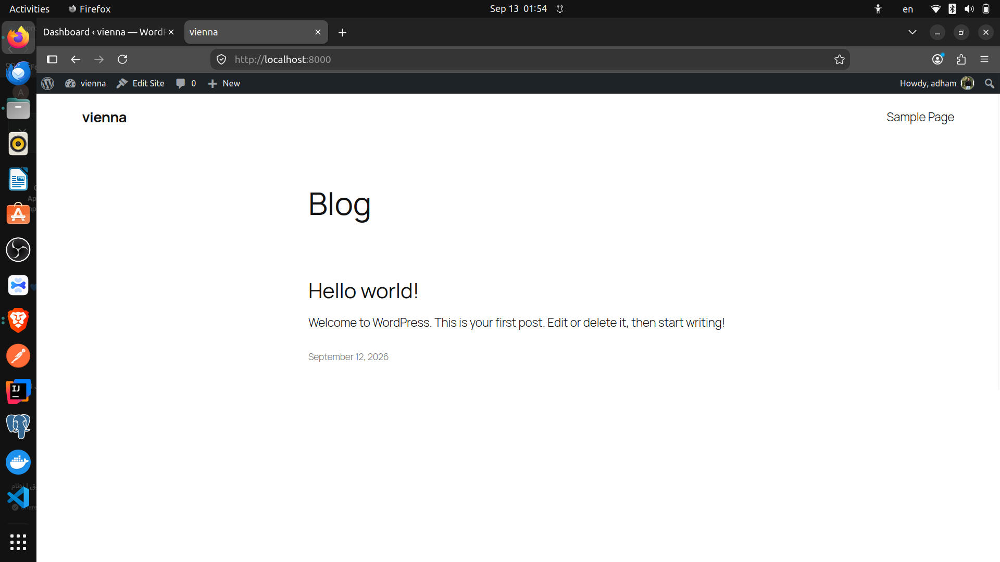
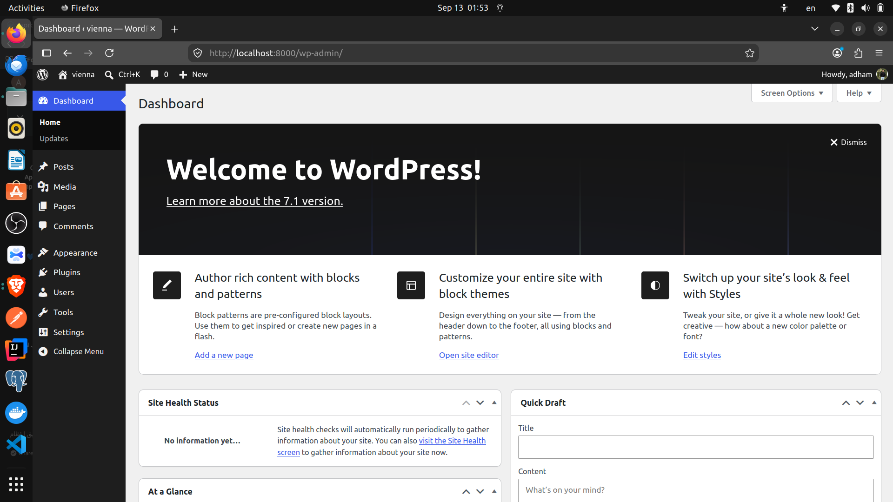
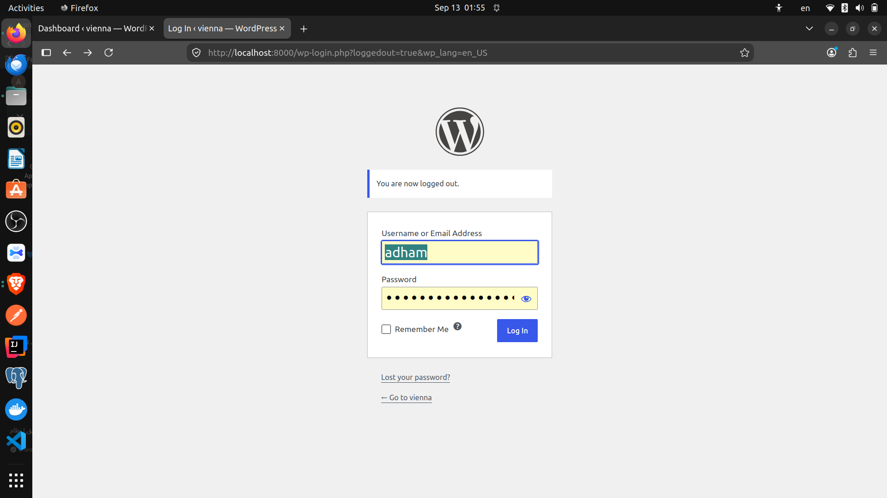
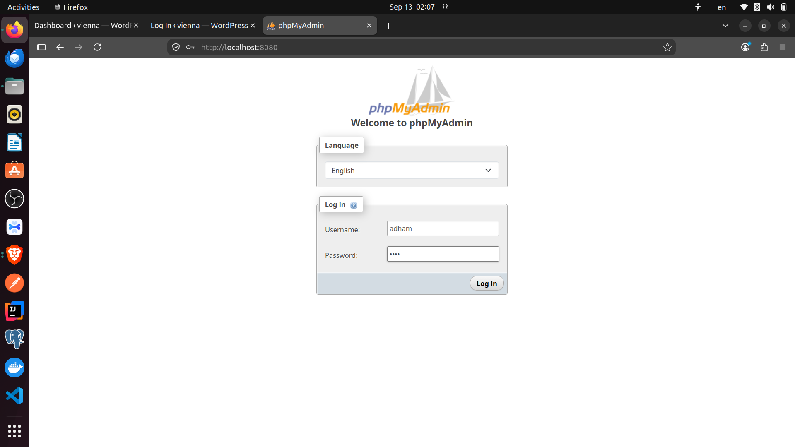
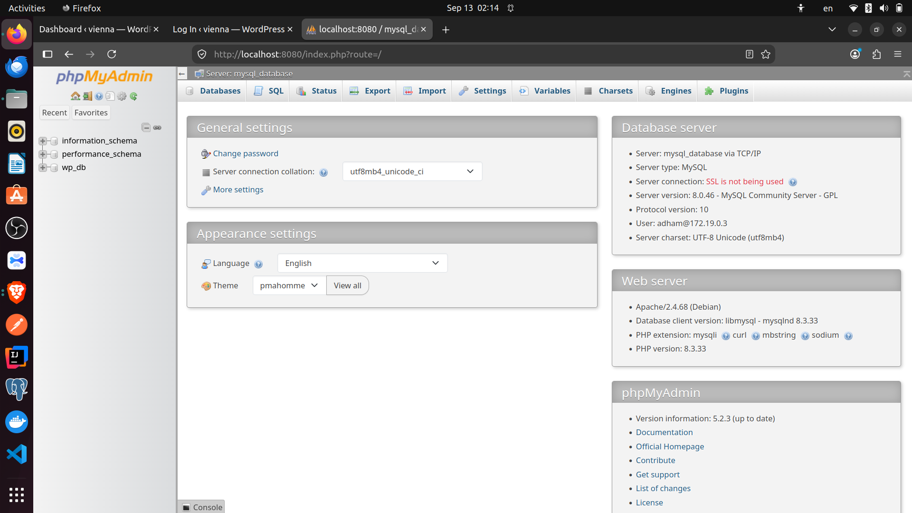

# 🐳 WordPress Docker Compose

A WordPress website deployed using Docker Compose with MySQL and phpMyAdmin.

## 🚀 Technologies

- Docker
- Docker Compose
- WordPress
- MySQL 8.0
- phpMyAdmin

## 🏗️ Architecture

The project consists of three containers:

- **WordPress** — Web application
- **MySQL** — Database
- **phpMyAdmin** — Database management

## ⚙️ Services

| Service | Port | Purpose |
|---|---:|---|
| WordPress | 8000 | Web application |
| phpMyAdmin | 8080 | Database management |
| MySQL | 3306 | Database |

## 💾 Persistent Storage

Docker volumes are used to persist data:

- `mysql` → MySQL database
- `wordpress` → WordPress files

## ▶️ Run

Start the project:

```bash
docker compose up -d

Check containers:

docker compose ps
🌐 Access

WordPress

http://localhost:8000

phpMyAdmin

http://localhost:8080

# 🐳 WordPress Docker Compose

A WordPress website deployed using Docker Compose with MySQL and phpMyAdmin.

## 🚀 Technologies

- Docker
- Docker Compose
- WordPress
- MySQL 8.0
- phpMyAdmin

## 🏗️ Architecture

The project consists of three containers:

- **WordPress** — Web application
- **MySQL** — Database
- **phpMyAdmin** — Database management

## ⚙️ Services

| Service | Port | Purpose |
|---|---:|---|
| WordPress | 8000 | Web application |
| phpMyAdmin | 8080 | Database management |
| MySQL | 3306 | Database |

## 💾 Persistent Storage

Docker volumes are used to persist data:

- `mysql` → MySQL database
- `wordpress` → WordPress files

## ▶️ Run

Start the project:

```bash
docker compose up -d

Check containers:

docker compose ps
🌐 Access

WordPress

http://localhost:8000

phpMyAdmin

http://localhost:8080

## 📸 Screenshots

### WordPress Setup


### WordPress Site


### phpMyAdmin


### Database


### Docker Containers


🛑 Stop
docker compose down
🗑️ Remove Containers and Volumes
docker compose down -v

## ▶️ Run the Project

Clone the repository:

```bash
git clone https://github.com/adhamgamal22/wordpress-docker-compose-project.git
cd wordpress-docker-compose-project

🛑 Stop
docker compose down
🗑️ Remove Containers and Volumes
docker compose down -v

## ▶️ Run the Project

Clone the repository:

```bash
git clone https://github.com/adhamgamal22/wordpress-docker-compose-project.git
cd wordpress-docker-compose-project
